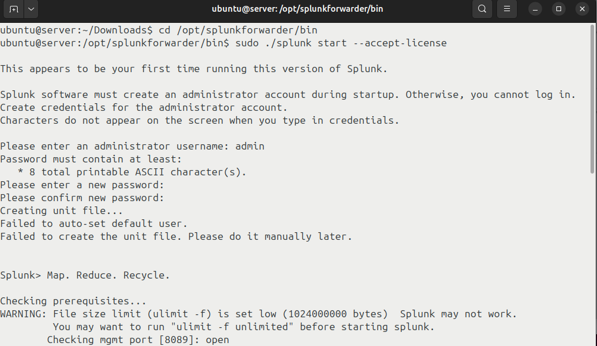
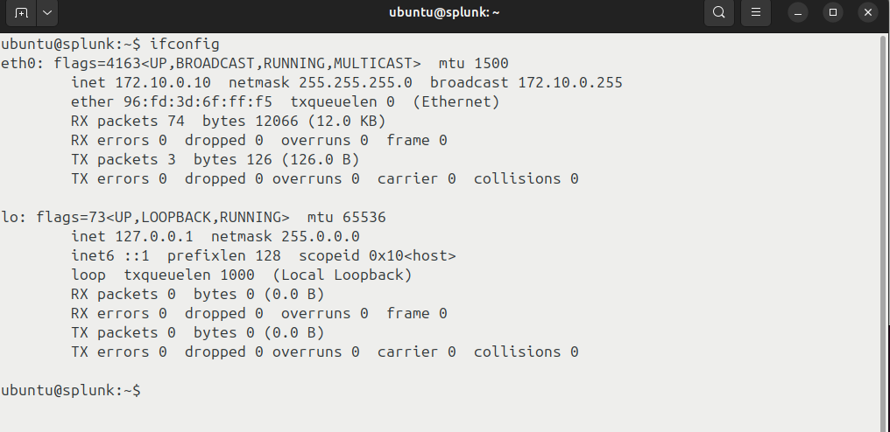
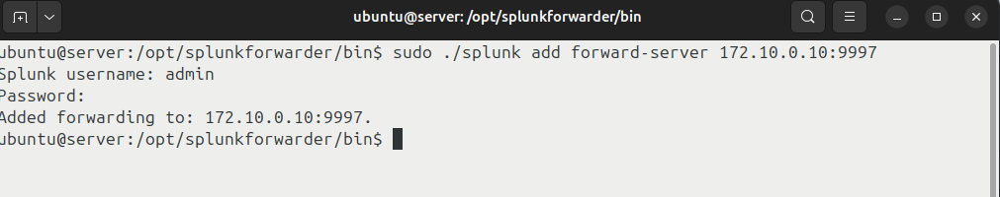
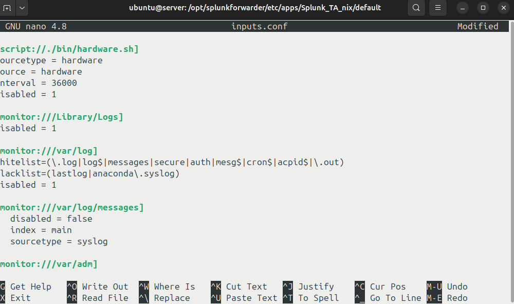

# Sửa lỗi đường dẫn tải lab và viết lại hướng dẫn
### **Nội dung và Hướng dẫn Bài Thực Hành - Cài đặt và Sử dụng Splunk**
* **Tải Imodule**: Link tải `imodule.tar`: [https://github.com/khuyennguyen128/AnNinhMang/releases/download/new/imodule.tar](https://github.com/khuyennguyen128/AnNinhMang/releases/download/new/imodule.tar)

#### **Mục đích Bài Thực Hành**

Bài thực hành này giúp sinh viên làm quen với **Splunk**, một công cụ mạnh mẽ dùng để tìm kiếm, giám sát và phân tích dữ liệu máy tính qua giao diện web. Cụ thể, sinh viên sẽ:

* Học cách **cài đặt và cấu hình Splunk** trên máy chủ.
* Hiểu cách **thu thập và phân tích log** hệ thống.
* Sử dụng Splunk để **giám sát và đưa ra báo cáo, cảnh báo** theo thời gian thực.

#### **Yêu cầu đối với Sinh viên**

* Có kiến thức cơ bản về **hệ điều hành Linux**, **mô hình mạng khách/chủ**.
* Hiểu về các loại **log trong hệ điều hành và web**, ví dụ: hệ thống log, log bảo mật, log ứng dụng.

#### **Nội dung Bài Thực Hành**

##### **1. Khởi động Bài Lab:**

1. **Mở terminal** trên hệ thống của bạn.

2. **Khởi động bài lab** bằng câu lệnh sau:

   ```bash
   labtainer -r ptit-splunk-n13
   ```


3. Sau khi khởi động thành công, **3 terminal ảo sẽ xuất hiện**, mỗi terminal sẽ đại diện cho một máy trong mạng LAN:

   * **Máy Splunk** 
   * **Máy client** 
   * **Máy server**

##### **2. Truy cập Giao Diện Web Splunk:**

1. Trên **terminal của client**, sử dụng lệnh sau để truy cập giao diện web của Splunk:

   ```bash
   firefox http://172.10.0.10:8000
   ```

2. Trên **terminal của server** (container `logserver`), thực hiện các thao tác để **Splunk thu thập log** từ server.
Thêm hướng dẫn 
### **1. Tải và Cài Đặt Splunk Universal Forwarder (Phiên Bản 10.0.0)**
#### **Bước 1: Tải Splunk Universal Forwarder**
1. Truy cập và tải **Splunk Universal Forwarder phiên bản 10.0.0** cho hệ điều hành Linux (ARM64):
   ```bash
   wget -O splunkforwarder-10.0.0-e8eb0c4654f8-linux-amd64.tgz "https://download.splunk.com/products/universalforwarder/releases/10.0.0/linux/splunkforwarder-10.0.0-e8eb0c4654f8-linux-amd64.tgz"
   ```
#### **Bước 2: Giải Nén và Cài Đặt Splunk Universal Forwarder**
2. Giải nén file tải về vào thư mục `/opt`:
   ```bash
   tar xvzf splunkforwarder-10.0.0-e8eb0c4654f8-linux-amd64.tgz
 -C /opt
   ```
3. Chuyển vào thư mục cài đặt Splunk Forwarder:
   ```bash
   cd /opt/splunkforwarder/bin

#### **Bước 3: Khởi Động Splunk Universal Forwarder**
4. Khởi động **Splunk Universal Forwarder** và đồng ý với các điều khoản giấy phép:
   ```bash
   ./splunk start --accept-license
   ```
   
---
### **2. Tải và Cài Đặt Splunk Add-on for Unix/Linux**
#### **Bước 1: Tải Splunk Add-on cho Unix/Linux**
1. Truy cập vào **Splunkbase** để tải **Splunk Add-on for Unix/Linux**. Đảm bảo bạn tải phiên bản tương thích với phiên bản Splunk bạn đang sử dụng (ví dụ, Splunk 10.0.0).
   * **Link tải Splunk Add-on cho Unix/Linux**: [Tải Splunk Add-on for Unix/Linux](https://splunkbase.splunk.com/app/833/)
#### **Bước 2: Giải Nén và Cài Đặt Splunk Add-on**
2. Sau khi tải về file `.tgz` của Add-on, sử dụng lệnh sau để giải nén vào thư mục cấu hình của **Splunk Forwarder**:
   ```bash
   tar -xvf splunk-add-on-for-unix-and-linux_8100.tgz -C /opt/splunkforwarder/etc/apps/
   ```
---

### **3. Cấu Hình Splunk Universal Forwarder**

#### **Bước 1: Cấu Hình Forwarder để Gửi Dữ Liệu**

1. Di chuyển đến thư mục chứa các file thực thi của Splunk Forwarder:

   ```bash
   cd /opt/splunkforwarder/bin
   ```

2. Thêm **Splunk server** mà bạn sẽ gửi dữ liệu log tới. Thay `<ip-address-of-splunk>` bằng địa chỉ IP của máy chủ Splunk:

   ```bash
   ./splunk add forward-server <ip-address-of-splunk>:9997
   ```
   
   

#### **Bước 2: Bật Chức Năng Khởi Động Tự Động**

3. Để đảm bảo rằng Splunk Forwarder tự động khởi động khi hệ thống khởi động lại, sử dụng lệnh sau:

   ```bash
   ./splunk enable boot-start
   ```

---

### **4. Cấu Hình Thu Thập Log**

#### **Bước 1: Cấu Hình Log Inputs**

1. Chuyển đến thư mục cấu hình của Splunk Forwarder:

   ```bash
   cd /opt/splunkforwarder/etc/apps/Splunk_TA_nix/default/
   ```

2. Mở file `inputs.conf` để cấu hình việc thu thập log:

   ```bash
   nano inputs.conf
   ```

3. Thêm cấu hình sau để giám sát log hệ thống:

   ```bash
   [monitor:///var/log/messages]
   disabled = false
   index = main
   sourcetype = syslog
   ```

4. Lưu và thoát khỏi file `inputs.conf` (nhấn `CTRL + X`, chọn `Y` để lưu và `Enter` để thoát).

#### **Bước 2: Khởi Động Lại Splunk Forwarder**

5. Khởi động lại Splunk Forwarder để áp dụng các thay đổi:

   ```bash
   ./splunk restart
   ```

---
6.Cấu hình splunk cho terminal Splunk
```bash
wget -O splunk-10.0.0-e8eb0c4654f8-linux-amd64.tgz "https://download.splunk.com/products/splunk/releases/10.0.0/linux/splunk-10.0.0-e8eb0c4654f8-linux-amd64.tgz"
tar -xvzf <thumucvuatai> -C /opt
cd /opt/splunk/bin: ./splunk start --accept-license
```

### **5. Kiểm Tra và Giám Sát Dữ Liệu**

#### **Bước 1: Truy Cập Giao Diện Web của Splunk**

1. Mở trình duyệt web và nhập địa chỉ của máy chủ Splunk:

   ```bash
   firefox http://<ip-address-of-splunk>:8000
   ```

2. Đăng nhập vào Splunk Web bằng tài khoản của bạn.

#### **Bước 2: Kiểm Tra Log Đã Thu Thập**

1. Truy vấn trong giao diện Splunk để kiểm tra dữ liệu log đã được thu thập:

   ```bash
   index="main" sourcetype="syslog"
   ```

2. Nếu log đã được thu thập, bạn có thể tiếp tục các bước tạo **Reports**, **Dashboards**, và **Alerts**.

---

### **6. Tạo Báo Cáo (Reports), Dashboard và Cảnh Báo (Alerts)**

#### **Bước 1: Tạo Báo Cáo**

1. Vào phần **Reports** trong giao diện Splunk.
2. Tạo báo cáo từ dữ liệu log thu thập được.

#### **Bước 2: Tạo Dashboard**

1. Vào phần **Dashboard** trong giao diện Splunk.
2. Tạo dashboard mới để trực quan hóa dữ liệu log.

#### **Bước 3: Tạo Cảnh Báo (Alerts)**

1. Vào **Settings** > **Searches, Reports, and Alerts**.
2. Tạo **alert** mới để theo dõi các sự kiện đặc biệt, ví dụ: đăng nhập không hợp lệ hoặc vượt quá số lần cho phép.

---


##### **3. Kết Thúc Bài Lab:**

1. Khi kết thúc bài lab, trên **terminal đầu tiên**, sử dụng câu lệnh sau để **dừng bài lab**:

   ```bash
   stoplab ptit-splunk-n13
   ```

2. Sau khi dừng bài lab, một **tệp zip lưu kết quả** sẽ được tạo tại một vị trí được hiển thị dưới câu lệnh `stoplab`.

##### **4. Khởi Động Lại Bài Lab:**

* Trong quá trình làm bài, nếu cần **khởi động lại bài lab**, bạn có thể sử dụng lệnh sau:

  ```bash
  startlab -r ptit-splunk-n13
  ```

---

---

### **Nhiệm Vụ Sinh Viên Cần Thực Hiện**

#### **Nhiệm Vụ 1: Cài đặt và Cấu hình Máy Chủ Log và Splunk**

* Cài đặt và cấu hình Splunk trên máy `splunk` và cấu hình Splunk Forwarder trên máy `logserver` để hai bên giao tiếp và thu thập log.

#### **Nhiệm Vụ 2: Tìm Địa Chỉ IP và Cổng Mở**

* Sử dụng **nmap** để tìm địa chỉ IP và cổng mở trên các máy Splunk và `logserver`.
* Kiểm tra kết nối tới máy chủ web Splunk bằng **ping**.

#### **Nhiệm Vụ 3: Tạo Index và Kiểm Tra Log**

* Tạo một **index** trong Splunk để nhận log từ `logserver`.
* Kiểm tra xem log đã được chuyển tới Splunk chưa bằng truy vấn:

  ```bash
  index="logserver"
  ```

#### **Nhiệm Vụ 4: Tạo Truy Vấn và Bắt Sự Kiện Log**

* Tạo truy vấn trong Splunk để tìm kiếm các sự kiện log trên `logserver`.

#### **Nhiệm Vụ 5: Tạo Báo Cáo (Reports)**

* Tạo **báo cáo** từ các dữ liệu log thu được.

#### **Nhiệm Vụ 6: Tạo Dashboard**

* Tạo **dashboard** từ dữ liệu log để trực quan hóa các thông tin.

#### **Nhiệm Vụ 7: Tạo Cảnh Báo (Alert)**

* Tạo **cảnh báo** khi có sự kiện đăng nhập không hợp lệ hoặc vượt quá số lần cho phép.

---


---


