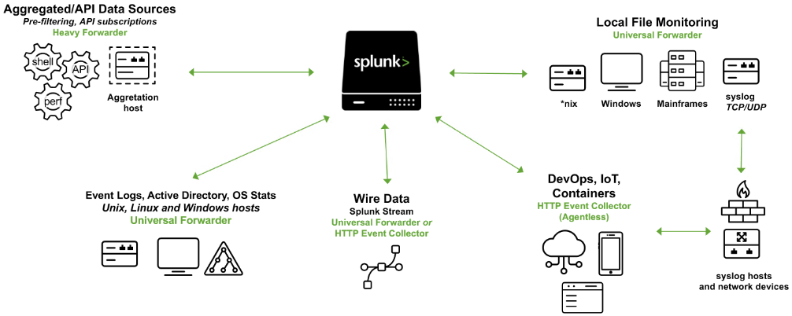
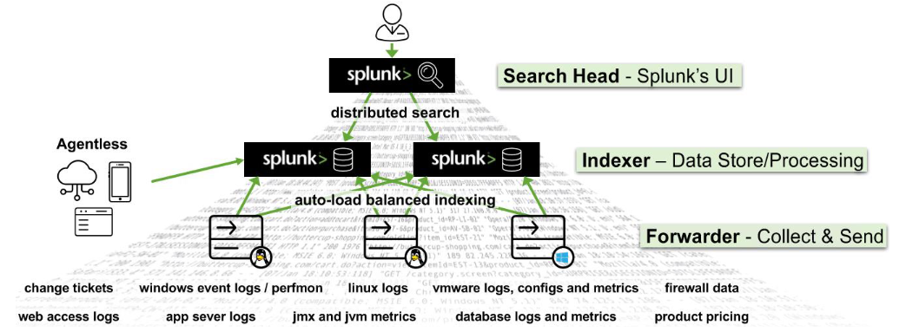

### **Splunk là gì?**

Splunk là một phần mềm phân tích dữ liệu mạnh mẽ, giúp thu thập, tổ chức, phân tích và trực quan hóa dữ liệu từ các hệ thống máy tính. Với khả năng mở rộng và linh hoạt, Splunk hỗ trợ các doanh nghiệp trong nhiều lĩnh vực như bảo mật mạng, quản lý dữ liệu, giám sát CNTT, phân tích hệ thống, và hỗ trợ các hoạt động kinh doanh hiệu quả.

Splunk có thể giúp bạn theo dõi và phân tích dữ liệu thời gian thực từ nhiều nguồn khác nhau, đồng thời cung cấp cái nhìn sâu sắc về những vấn đề quan trọng, như sự cố bảo mật, hiệu suất hệ thống, và hoạt động kinh doanh.




---

### **Kiến Trúc của Splunk**

Kiến trúc của **Splunk Enterprise** được chia thành nhiều thành phần hoạt động đồng thời để thu thập, chỉ mục, tìm kiếm và phân tích dữ liệu. Các thành phần chính trong kiến trúc của Splunk gồm:

#### **Forwarders** (Thu thập dữ liệu)

Các forwarders là các agent chịu trách nhiệm thu thập dữ liệu từ nhiều nguồn khác nhau và chuyển chúng đến các indexers để xử lý. Có hai loại forwarders chính:

* **Universal Forwarder (UF)**: Là một agent nhẹ, không làm ảnh hưởng đến hiệu suất hệ thống, thu thập và gửi dữ liệu tới indexers mà không qua xử lý trước.
* **Heavy Forwarder (HF)**: Là agent nặng, có khả năng xử lý dữ liệu trước khi gửi đi và có thể chỉ mục dữ liệu cục bộ, thường được sử dụng cho các nguồn dữ liệu phức tạp như tường lửa hoặc các điểm lọc dữ liệu.

Ngoài ra, **HTTP Event Collectors (HEC)** cho phép thu thập dữ liệu từ các ứng dụng qua API.

#### **Indexers** (Xử lý và lưu trữ dữ liệu)

Các indexers nhận dữ liệu từ forwarders, tổ chức và lưu trữ chúng vào các chỉ mục. Khi xử lý dữ liệu, indexers sẽ tạo các thư mục chứa dữ liệu gốc và chỉ mục, đồng thời xử lý các truy vấn tìm kiếm từ người dùng và trả về kết quả.

#### **Search Heads** (Điều phối tìm kiếm)

Search heads giúp điều phối các công việc tìm kiếm, phân phối chúng đến các indexers và hợp nhất kết quả tìm kiếm. Đây là nơi người dùng tương tác với Splunk thông qua giao diện người dùng để tìm kiếm, tạo báo cáo và tạo dashboard.

#### **Deployment Server** (Quản lý cấu hình)

Deployment Server giúp quản lý cấu hình cho các forwarders và phân phối các ứng dụng, cập nhật cho hệ thống.

#### **Cluster Master** (Điều phối hoạt động của indexers)

Cluster Master giúp điều phối các hoạt động của indexers trong môi trường cụm, đảm bảo sao chép dữ liệu và duy trì liên kết tìm kiếm hiệu quả.

#### **License Master** (Quản lý giấy phép)

License Master giúp quản lý giấy phép của Splunk và đảm bảo rằng hệ thống hoạt động trong phạm vi giấy phép đã cấp.

#### **Các thành phần chính khác**:

* **Giao diện Web của Splunk**: Là giao diện đồ họa giúp người dùng tương tác với Splunk, tìm kiếm dữ liệu, tạo báo cáo, cảnh báo, dashboard.
* **Search Processing Language (SPL)**: Ngôn ngữ truy vấn của Splunk, cho phép người dùng tìm kiếm và thao tác với dữ liệu đã chỉ mục.

---

### **Splunk như một giải pháp SIEM**

Trong lĩnh vực bảo mật mạng, Splunk đóng vai trò quan trọng trong việc **quản lý log** và có giá trị lớn hơn khi được sử dụng như một giải pháp **Security Information and Event Management (SIEM)**. Splunk giúp phân tích dữ liệu thời gian thực và lịch sử, hỗ trợ giám sát bảo mật, phản hồi sự cố và săn lùng mối đe dọa.

Splunk còn giúp nâng cao khả năng phát hiện sự cố qua việc **phân tích hành vi người dùng** (User Behavior Analytics), giúp nhận diện các mối đe dọa tiềm ẩn trong hệ thống.

---

### **Các Truy Vấn Cơ Bản với SPL (Search Processing Language)**

SPL (Search Processing Language) là ngôn ngữ truy vấn của Splunk, bao gồm hơn một trăm lệnh, hàm và đối số. Nó là công cụ giúp người dùng tìm kiếm, lọc, biến đổi và trực quan hóa dữ liệu trong Splunk.

**Ví dụ về các truy vấn cơ bản**:

* **Tìm kiếm sự kiện**:

  ```splunk
  search index="main" "UNKNOWN"
  ```

* **Sử dụng toán tử Boolean (AND, OR, NOT)**:

  ```splunk
  index="main" EventCode!=1
  ```

* **Câu lệnh `fields`**: Chỉ định các trường cần bao gồm hoặc loại trừ trong kết quả tìm kiếm:

  ```splunk
  index="main" sourcetype="WinEventLog:Sysmon" EventCode=1 | fields - User
  ```

* **Câu lệnh `table`**: Hiển thị kết quả tìm kiếm dưới dạng bảng:

  ```splunk
  index="main" sourcetype="WinEventLog:Sysmon" EventCode=1 | table _time, host, Image
  ```

* **Câu lệnh `rename`**: Đổi tên trường trong kết quả tìm kiếm:

  ```splunk
  index="main" sourcetype="WinEventLog:Sysmon" EventCode=1 | rename Image as Process
  ```

* **Câu lệnh `dedup`**: Loại bỏ các sự kiện trùng lặp:

  ```splunk
  index="main" sourcetype="WinEventLog:Sysmon" EventCode=1 | dedup Image
  ```

* **Câu lệnh `eval`**: Tạo hoặc tái định nghĩa các trường:

  ```splunk
  index="main" sourcetype="WinEventLog:Sysmon" EventCode=1 | eval Process_Path=lower(Image)
  ```

* **Câu lệnh `rex`**: Trích xuất các trường mới từ các trường hiện có bằng biểu thức chính quy:

  ```splunk
  index="main" EventCode=4662 | rex max_match=0 "[^%](?<guid>{.*})" | table guid
  ```

---

### **Xác Định Dữ Liệu và Trường trong Splunk**

Để xác định các loại nguồn dữ liệu và các trường trong dữ liệu, bạn có thể sử dụng các lệnh SPL như sau:

* **Lệnh `metadata`**: Trả về các thông tin thống kê về các sourcetypes:

  ```splunk
  | metadata type=sourcetypes index=* | table sourcetype
  ```

* **Lệnh `fieldsummary`**: Tạo bảng tóm tắt về các trường trong dữ liệu:

  ```splunk
  sourcetype="WinEventLog:Security" | fieldsummary
  ```

* **Lệnh `inputlookup`**: Truy xuất dữ liệu từ một tệp lookup:

  ```splunk
  | inputlookup malware_lookup.csv
  ```

---

### **Sử Dụng Web Interface trong Splunk**

Khi sử dụng giao diện người dùng Web của Splunk, bạn có thể xác định các nguồn dữ liệu, các sự kiện và các trường trong dữ liệu thông qua các công cụ như **Search & Reporting** và **Data Models**. Việc tìm kiếm các sự kiện và khám phá các trường qua giao diện này giúp phân tích dữ liệu trở nên dễ dàng và trực quan hơn.

---

Splunk là một công cụ mạnh mẽ giúp giám sát bảo mật, tìm kiếm và trực quan hóa dữ liệu từ các hệ thống phức tạp. Với các khả năng như tạo báo cáo, cảnh báo và dashboard, Splunk giúp các tổ chức nhanh chóng phát hiện và giải quyết các vấn đề trong thời gian thực.
